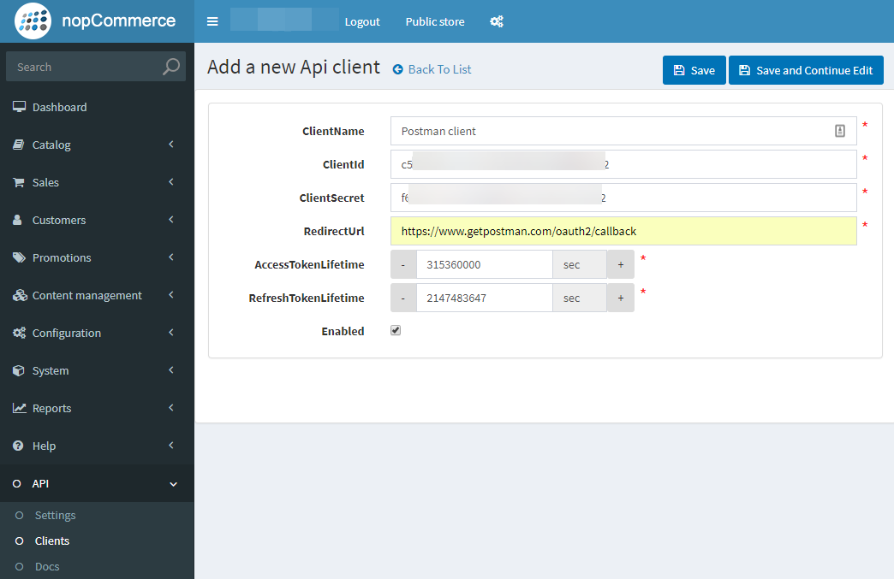
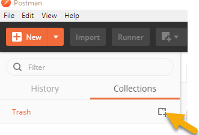
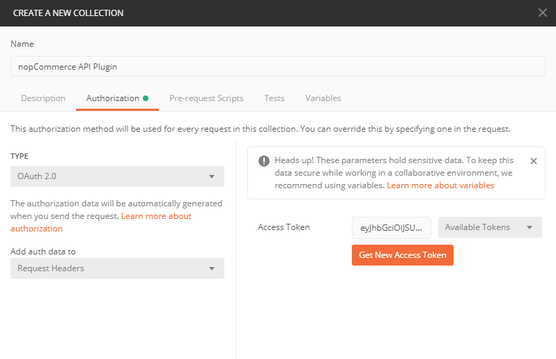
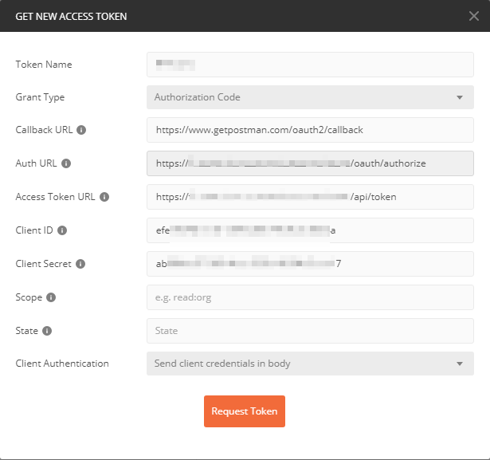
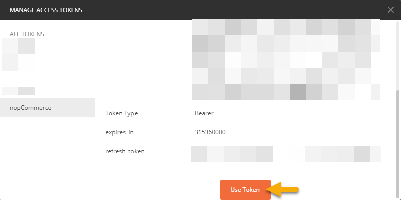
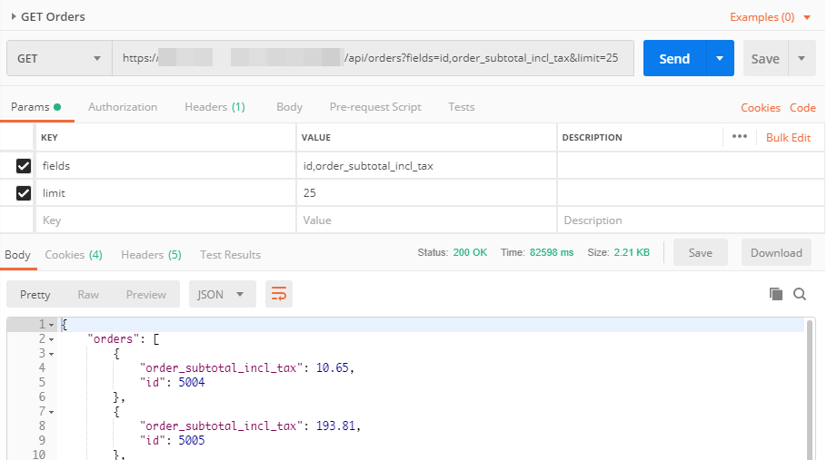
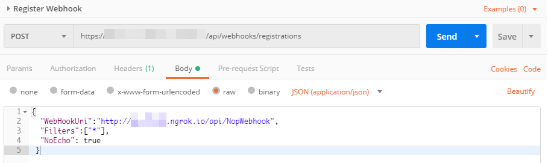

# Instructions for using Postman to test the nopCommerce API Plugin

Postman is a popular and powerful tool for learning and testing APIs. This guide will give instructions for 
using Postman against the nopCommerce API Plugin, mostly helping with authentication which can be confusing. 

## Prerequisites

- Postman is installed and configured
- The nopCommerce API Plug-in is installed and enabled
- Access to a nopCommerce site with admin credentials 

## Instructions

### Configure the API Client in the NopCommerce Admin portal

Once the nopCommerce API Plugin is installed, client credentials must be created. These are key-based credentaials
for Auth 2.0 and are separate from built-in nopCommerce logins.

From the Admin site, go to API/Clients and choose Add New. Name the client (this can be anything but 'Postman client'
can be a good name to remember where this connection is being used). 

You will need to take note of the ClientId and ClientSecret values. You can leave these to their default values. The 
RedirectUrl should be set to: https://www.getpostman.com/oauth2/callback 

### Create a new Postman request collection for the nopCommerce API requests

It is easiest to configure the authentication credentials under a Postman request collection. This way, 
all requests under that collection will share these credentials.

Create a new collection by clicking the new button over the left-side collection list.

Name the new collection (here we use 'nopCommerce API Plugin') and choose the Authorization tab. Choose
type 'OAuth 2.0'. Keep the 'Add auth data to' defaulted to 'Request Headers'.

Click the 'Get New Access Token' button and fill in the parameters as shown below.

'Grant Type' should be 'Authorization code'.

Use the URL of the
nopCommerce site followed by '/oauth2/callback' for the 'Auth URL' parameter, followed by '/api/token'
for the 'Access Token URL'. So if your site is https://example.com', 'Auth URL' should be
'https://example.com/oauth2/callback' and so on.

Callback URL should be 'https://www.getpostman.com/oauth2/callback'.

Client Authentication should be set to 'Send client credentials in body'. Scope and State can be blank.

The form should look as above. Click on the 'Request Token' and Postman will attempt to get a key from
the nopCommerce API Plugin. If this is successful, the token details should appear. Scroll down and 
click the 'Use Token' button.

At this point, the 'Create New Collection' dialog should be back. Click 'Create' to create the
collection.

### Add a query to the Postman collection

Now simply right-click on the Postman collection and add requests. The requests should be based off
the /api path from the root of the site. The authorization settings from the collection should
carry through to the request.

Here is an example of a GET Orders request:

### Webhooks

Webhooks can be created in the nopCommerce API Plugin with Postman. Here is a Webhook registration
to send all events to a local development instance via an [ngrok](https://ngrok.com) proxy:

See the [Webhook guide](WebHooks.md) for details on how to use Webhooks with the nopCommerce API Plugin.

## Review

This configuration in Postman can be used to test the REST API and even configure Webhooks on the
service.